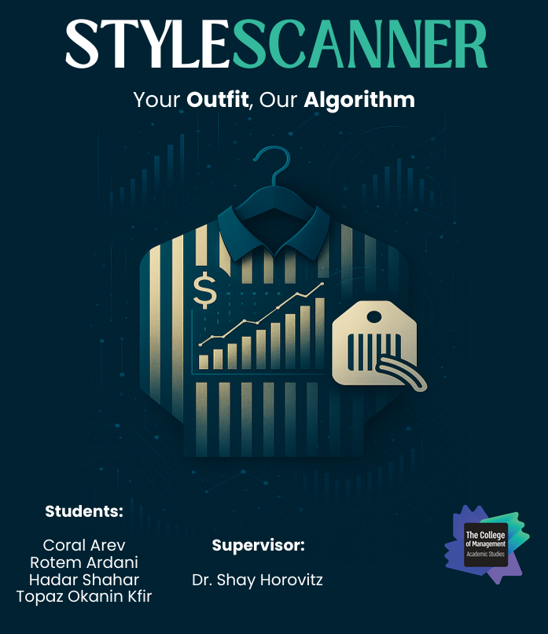

# STYLESCANNER - Clothing Item Price Prediction System

## Overview

This project provides an intelligent, automated **Mobile** system for predicting the price range of clothing items based solely on images. By combining advanced computer vision techniques with machine learning algorithms, the system delivers accurate and dynamic price estimations that account for visual features, market trends, and contextual data such as location.

The solution includes a full-stack architecture:
- **Frontend**: A user-friendly interface for uploading images and viewing price predictions.
- **Backend**: A Flask-based API that processes images using pre-trained models (CNN and XGBoost) and returns predicted price ranges.

  
  

## System Components

### Frontend

The frontend provides a clean and intuitive interface allowing users to:

- Upload a clothing item image.
- Instantly receive the predicted price range.
- View the image alongside the output to understand how the system responds to different item types.

Although not detailed here, the frontend is built using a modern framework (Java for mobile app), with a clear separation of presentation and logic layers.

### Backend

The backend is built using Flask and exposes a REST API for image processing and prediction. It includes the following core functionality:

- Accepts base64-encoded images from the frontend.
- Processes images with a CNN model to extract relevant features.
- Predicts price range using a pre-trained XGBoost model.
- Returns a JSON response with `min_range` and `max_range`.

The backend includes pre-trained models, environment-based configuration, and support for cross-origin requests to integrate smoothly with any frontend framework.

## How It Works

1. The user uploads a clothing item image through the frontend interface.
2. The image is encoded and sent to the backend's `/predictimage` endpoint.
3. The backend:
   - Decodes and preprocesses the image.
   - Uses a convolutional neural network to extract visual features.
   - Passes the features to a price prediction model (e.g., XGBoost).
4. The API responds with a predicted price range (min and max value).
5. The frontend displays the result to the user in real time.

## Requirements

### Backend

- Python, Flask
- PyTorch & Torchvision (for CNN)
- dotenv, flask-cors
- Pre-trained models (.pkl, .pth)

### Frontend

- Interface for image upload and result display (mobile)
- API integration with backend

## Getting Started

1. **Clone the repository**.
2. **Set up the backend**:
   - Install dependencies with `pip install -r requirements.txt`
   - Add a `.env` file with model paths and configuration.
   - Run the Flask server with `python run.py`
3. **Set up the frontend** (implementation-specific):
   - Configure API endpoint.
   - Build and run the interface for image upload.

## Final Notes

This project showcases the fusion of vision-based modeling and predictive analytics for solving real-world pricing problems in the fashion industry. It serves as a scalable foundation for further development, supporting both end-user interactions and data-driven business decisions.
